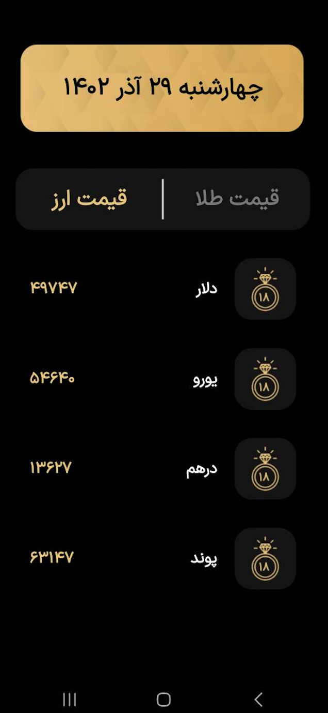

# GoldApp
Online display of the price of gold, coins and common currencies

## Table of Content 
- [specification](#specification)
- [libraries](#libraries)
- [screenshots](#screenshots)

## specification 
- 33 < SdkVersion > 23 (6 < AndroidVersion > 13)
- Kotlin 1.10.1

## libraries 
- retrofit2
- constraintlayout
- gson

## screenshots

Home page

    

Gold page

    

Currency page

    

